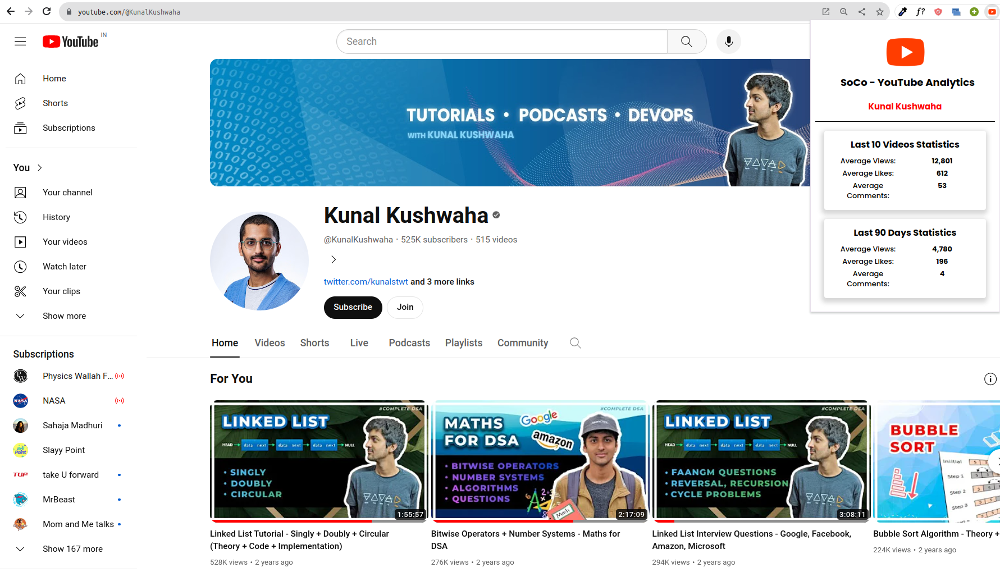

**SoCo - YouTube Analytics**
 
*Setup Instructions*
 
Follow these steps to set up SoCo and enjoy easy access to YouTube analytics.

**1. Download soCo Folder**
 
Ensure you have the soCo folder downloaded to your device.

**2. Open Chrome Extensions**
 
Open your Google Chrome browser and go to chrome://extensions/.

**3. Enable Developer Mode**
 
Toggle on the "Developer Mode" option, usually located in the top-right corner of the Extensions page.

**4. Load Unpacked Extension**
 
Click on "Load Unpacked" to upload the soCo Folder.

**5. Upload SoCo Folder**
 
Select the soCo Folder from your device and upload it.

**6. Pin the Extension**
 
After uploading, make sure to pin the SoCo extension for easy access.

*Get YouTube Analytics with Ease!*
 
**Now, visit YouTube, and you'll find access to analytics with ease using SoCo.**
 
Enjoy a clean and neat analytics experience!

**DEMO**
 

